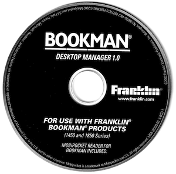

# Franklin Bookman Desktop Manager   CD-key generator 🔓💿🖥️

This code pertains to the setup step in one of these installation CDs:
- https://archive.org/details/franklin-bookman-desktop-manager-1.0
- https://archive.org/details/franklin-bookman-desktop-manager-1.2
- https://archive.org/details/bookman-desktop-manager-1.21
- https://archive.org/details/franklin-bookman-desktop-manager-1.3

See https://jsyang.ca/hacks/franklin-bookman-desktop-manager-cd-key-scheme-reversed/ for the reversing process used to write the keygen.

You can import this repo as a library. Or you can also use it live at https://bdm-cd-keygen.herokuapp.com/

## MIT licensed.
